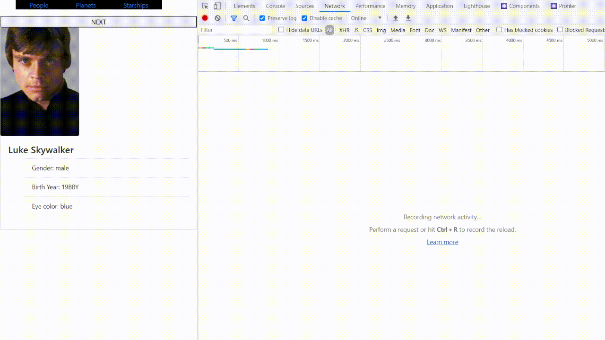

# React online marathon

## The tasks of the topic Ajax:

### Task 1

Create Star Wars database application.
Use [swapi.dev](https://swapi.dev/) for data and [starwars-visualguide.com](https://starwars-visualguide.com/) for images.

Application will show:

- image with SW person
- h3 tag with name
- li elements with:

  - Gender
  - Birth Year
  - Eye color

- Button "NEXT". It loads the next person.

### Task 2

Do the same with "Planets" and "Starships".
Their data cards will have at least 3 data fields.

### Task 3

At the top of the page, add a Header component. When you click on the corresponding header menu, only the required component is rendered. People is render by default

###Requierements:

- use axios library for ajax
- take out work with ajax and data formatting into a separate class file and name it `/src/services/sw-service.js`
- the root element `App` must be in the `/src/components/App/` directory
- using Router is not necessary in this task
- You are free in styles. Make the app prettier than the gif 8-)
